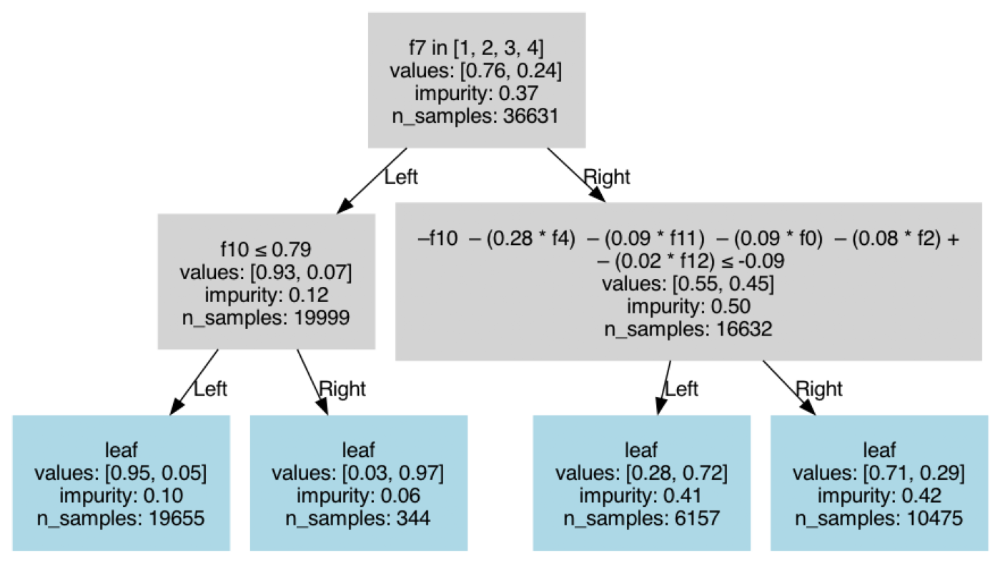

# Example Usage

This guide demonstrates how to use the `obliquetree` library's `Classifier` for training decision trees with oblique splits and visualizing the results. The examples explore different configurations, including oblique and non-oblique splits, and highlight the library's support for categorical data.

## Imports
```python
from obliquetree import Classifier
from obliquetree.utils import visualize_tree

from sklearn.datasets import fetch_openml
from sklearn.model_selection import train_test_split
from sklearn.preprocessing import StandardScaler, LabelEncoder
from sklearn.metrics import accuracy_score
```

---

## Data Preparation

We use the "Adult" dataset from OpenML, apply preprocessing, and split it into training and testing sets.

```python
RANDOM_STATE = 42

X, y = fetch_openml("adult", version=2, return_X_y=True)
y = (y == ">50K").astype(int)

cat_column = X.select_dtypes(exclude="number").columns
numeric_columns = X.select_dtypes(include="number").columns

encoder = LabelEncoder()
for col in cat_column:
    X[col] = X[col].astype(str)
    X[col] = encoder.fit_transform(X.loc[:, col]).astype(float)

X_train, X_test, y_train, y_test = train_test_split(X, y, random_state=RANDOM_STATE)

scaler = StandardScaler()
X_train[numeric_columns] = scaler.fit_transform(X_train[numeric_columns])
X_test[numeric_columns] = scaler.transform(X_test[numeric_columns])

cat_idx = [X_train.columns.get_loc(col) for col in cat_column]
```

```{note}
Scaling is important for oblique splits. Since `obliquetree` supports categorical data, we pass the indices of categorical columns via `cat_idx`.
```

---

## Example 1: Oblique Tree with Default Settings

```python
clf = Classifier(
    use_oblique=True,
    max_depth=2,
    n_pair=2,
    random_state=RANDOM_STATE,
    categories=cat_idx,
)

clf.fit(X_train, y_train)

train_pred = clf.predict(X_train)
train_mse = accuracy_score(y_train, train_pred)

test_pred = clf.predict(X_test)
test_mse = accuracy_score(y_test, test_pred)

print(train_mse, test_mse)
```

**Output:**
```
0.8395075209521989 0.8513635246908525
```

```{note}
Here, `n_pair=2` by default, meaning oblique splits are computed using only two features.
```

```python
visualize_tree(clf)
```


---

## Example 2: Axis-Aligned Tree with Categorical Support

```python
clf = Classifier(
    use_oblique=False,
    max_depth=2,
    categories=cat_idx,
)

clf.fit(X_train, y_train)

train_pred = clf.predict(X_train)
train_mse = accuracy_score(y_train, train_pred)

test_pred = clf.predict(X_test)
test_mse = accuracy_score(y_test, test_pred)

print(train_mse, test_mse)
```

**Output:**
```
0.826704157680653 0.8381786913438702
```

```{note}
This configuration removes oblique splits but still supports categorical data. Random state is not required for axis-aligned splits.
```

```python
visualize_tree(clf)
```


---

## Example 3: Axis-Aligned Tree Without Categorical Support

```python
clf = Classifier(
    use_oblique=False,
    max_depth=2,
)

clf.fit(X_train, y_train)

train_pred = clf.predict(X_train)
train_mse = accuracy_score(y_train, train_pred)

test_pred = clf.predict(X_test)
test_mse = accuracy_score(y_test, test_pred)

print(train_mse, test_mse)
```

**Output:**
```
0.8238923316316781 0.8340021292277455
```

```{note}
In this configuration, both oblique splits and categorical support are disabled, 
yielding results consistent with standard `scikit-learn` trees.
```


```python
visualize_tree(clf)
```


---

## Example 4: Oblique Tree with `n_pair` Set to Total Features

```python
clf = Classifier(
    use_oblique=True,
    max_depth=2,
    random_state=RANDOM_STATE,
    n_pair=X.shape[1],
    categories=cat_idx,
)

clf.fit(X_train, y_train)

train_pred = clf.predict(X_train)
train_mse = accuracy_score(y_train, train_pred)

test_pred = clf.predict(X_test)
test_mse = accuracy_score(y_test, test_pred)

print(train_mse, test_mse)
```

**Output:**
```
0.84021730228495 0.8489886168208992

UserWarning: Total features: 14, categorical features: 8. n_pair (14) exceeds the usable features, adjusting n_pair to 6.
```

```{important}
When `n_pair` exceeds the number of usable features, the library automatically adjusts it. Oblique splits do not support categorical features directly, so the `n_pair` count is reduced.
```

```python
visualize_tree(clf)
```

